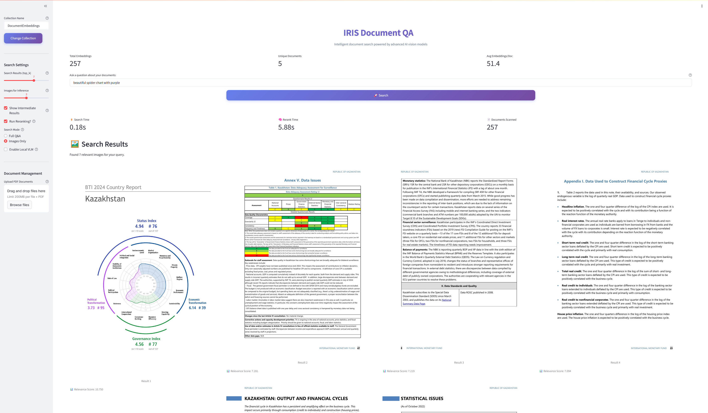

# Document Embeddings with InterSystems IRIS Cloud SQL

This project demonstrates how to create embeddings from documents using **Nomic’s multimodal embedding models** and store them in **InterSystems IRIS Cloud SQL**. It also provides a **Streamlit UI** to search across your embedded data.

---
<p align="center">

</p>

## 0. Requirements

This project requires:

* **Python 3.11+**
* **pip** or [**uv**](https://docs.astral.sh/uv/) for environment setup
* **GPU** (for local inference with `nomic-ai/colnomic-embed-multimodal-3b` or `7b`)

  * Recommended at least 12gb VRAM: **NVIDIA T4 or RTX 3090**

---

## 1. Cloud SQL Trial

To get started, you’ll need access to the **InterSystems Cloud SQL Trial**:

1. Sign up at [InterSystems Cloud SQL Trial](https://cloud.intersystems.com).
2. Create a new **SQL database** instance.
3. Copy your **connection details** (host, port, user, password, namespace).
4. Download the connection certificate from cloud SQL and rename connection.pem (and put in the connection folder.)


This will guide you through entering your database credentials and automatically create a `.env-new` file with the necessary configuration. Copy this to `.env`

---

## 2. Setting up Project

Clone the repo and install dependencies:

```bash
git clone https://github.com/isc-nmitchko/iris-document-search.git
cd iris-document-search
pip -m venv .venv
source .venv/bin/activate
pip install -r requirements.txt
```

Run setup to configure your environment:

```bash
python main.py --setup
```

This will create a `.env` file containing your IRIS connection string and model settings.

---

## 4. Embedding Data

You can embed documents (PDFs, text files, etc.) using the **Nomic multimodal embedding models**:

* `"nomic-ai/colnomic-embed-multimodal-3b"` (lighter, faster)
* `"nomic-ai/colnomic-embed-multimodal-7b"` (larger, more accurate)

Example usage:

```bash
python main.py --embed ./data/my_docs/
```

This will:

1. Extract text from your documents.
2. Generate embeddings using the configured model.
3. Insert the embeddings into your **InterSystems IRIS Cloud SQL** instance.

---

## 5. Searching using Streamlit UI

To search across embedded data, launch the Streamlit UI:

```bash
streamlit run ui2.py
```

Features include:

* Free-text semantic search
* Similarity ranking of documents
* Viewing results directly in a web interface